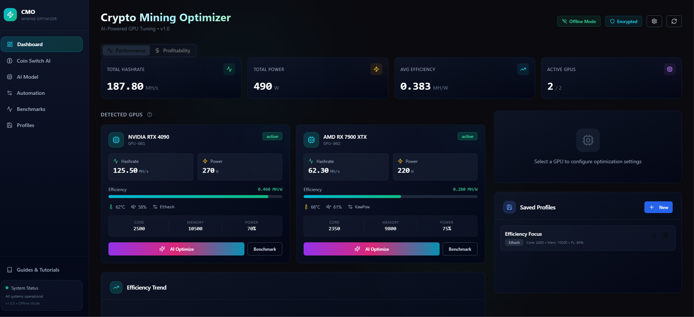
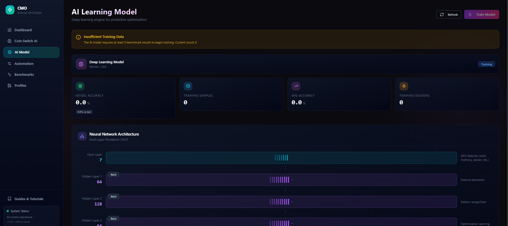
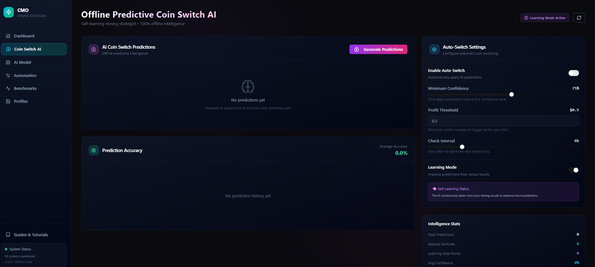

# Crypto Miner Optimizer

<div align="center">


[](https://reactjs.org/)
[](https://vitejs.dev/)
[](https://tailwindcss.com/)
[](LICENSE)

**AI-Powered GPU Cryptocurrency Mining Optimization Tool**

*Maximize your mining efficiency with deep learning-based GPU tuning and real-time profitability analysis*

[Features](#features) • [Installation](#installation) • [Usage](#usage) • [Screenshots](#screenshots) • [Tech Stack](#tech-stack)

</div>

---

## Overview

Crypto Miner Optimizer (CMO) is a comprehensive desktop application designed to help cryptocurrency miners maximize their GPU mining efficiency. Using AI-powered optimization algorithms, CMO automatically tunes your GPU settings for optimal hashrate-to-power ratios while providing real-time profitability tracking across multiple cryptocurrencies.


## Features

### 🎯 AI-Powered GPU Optimization
- **Deep Learning Optimization**: Uses machine learning to predict optimal GPU settings based on your hardware
- **Automatic Tuning**: One-click optimization for core clock, memory clock, and power limits
- **Continuous Learning**: The AI model improves over time by learning from your GPU's performance data

### 📊 Real-Time Monitoring
- **Live GPU Stats**: Monitor hashrate, power consumption, temperature, and efficiency in real-time
- **Historical Charts**: Track performance trends over time with interactive visualizations
- **Multi-GPU Support**: Manage and monitor multiple GPUs from a single dashboard

### 💰 Profitability Analysis
- **Live Market Data**: Real-time cryptocurrency prices with automatic updates
- **ROI Calculator**: Calculate daily, weekly, and monthly profits per GPU
- **Algorithm Comparison**: Compare profitability across different mining algorithms
- **Price Alerts**: Set custom alerts for cryptocurrency price movements

### 🔄 Predictive Coin Switching
- **AI Predictions**: Machine learning-based predictions for optimal coin switching
- **Auto-Switch Configuration**: Automatically switch to the most profitable coin
- **Prediction Accuracy Tracking**: Monitor and improve prediction accuracy over time

### ⚙️ Automation & Profiles
- **GPU Profiles**: Save and load custom GPU settings profiles
- **Automation Rules**: Set up rules for automatic GPU management
- **Hardware Alerts**: Get notified about critical hardware events (overheating, fan failures, etc.)
- **Remote Control**: Manage your GPUs remotely

### 📈 Benchmarking
- **Comprehensive Benchmarks**: Run detailed performance tests on your GPUs
- **Algorithm-Specific Tests**: Benchmark performance for different mining algorithms
- **Performance Comparison**: Compare results across different settings and configurations

### 🏥 GPU Health Monitoring
- **Predictive Failure Detection**: AI-based prediction of potential hardware failures
- **Health History Logging**: Track GPU health metrics over time
- **Preventive Alerts**: Get warned before critical issues occur

## Screenshots

<div align="center">

### Dashboard

*Main dashboard with GPU monitoring and performance stats*

### Profitability Analysis

*Real-time profitability tracking and algorithm comparison*

### AI Optimization

*AI model training and optimization interface*

### Coin Switch

*Predictive coin switching with ML-based recommendations*

</div>

## Installation

### Prerequisites

- [Node.js](https://nodejs.org/) (v18 or higher)
- [npm](https://www.npmjs.com/) or [yarn](https://yarnpkg.com/)

### Quick Start

1. **Clone the repository**
   ```bash
   git clone https://github.com/NeuroKoder3/crypto-miner-optimizer.git
   cd crypto-miner-optimizer
   ```

2. **Install dependencies**
   ```bash
   npm install
   ```

3. **Start the development server**
   ```bash
   npm run dev
   ```

4. **Open in browser**
   Navigate to `http://localhost:5173`

### Building for Production

```bash
# Build the application
npm run build

# Preview the production build
npm run preview
```

### Desktop Application (Qt)

The application can also be built as a native desktop application using Qt WebEngine:

```bash
cd qt
mkdir build && cd build
cmake ..
cmake --build .
```

### Windows Installer

To create a Windows installer, use Inno Setup with the provided script:

```bash
# Build the web app first
npm run build

# Then compile the installer using Inno Setup
# Open installer/CryptoMinerOptimizer.iss in Inno Setup and compile
```

## Usage

### Getting Started

1. **Add Your GPUs**: The application will automatically detect connected GPUs, or you can add them manually
2. **Run Benchmarks**: Benchmark your GPUs to establish baseline performance metrics
3. **Enable AI Optimization**: Click "AI Optimize" on any GPU card to let the AI find optimal settings
4. **Monitor Profitability**: Switch to the Profitability tab to track earnings in real-time

### Key Pages

| Page | Description |
|------|-------------|
| **Dashboard** | Main monitoring hub with GPU cards, stats overview, and profitability tracking |
| **Coin Switch AI** | Configure automatic coin switching based on AI predictions |
| **AI Model** | View and manage the AI optimization model, training data, and predictions |
| **Automation** | Set up automation rules, remote control, and hardware alerts |
| **Benchmarks** | Run and view GPU benchmarks with detailed performance metrics |
| **Profiles** | Create, save, and load GPU configuration profiles |

### Keyboard Shortcuts

| Shortcut | Action |
|----------|--------|
| `R` | Refresh GPU data |
| `O` | Open optimization panel |
| `P` | Toggle profitability view |

## Tech Stack

### Frontend
- **React 18** - UI framework
- **Vite** - Build tool and dev server
- **TailwindCSS** - Utility-first CSS framework
- **Framer Motion** - Animation library
- **Recharts** - Chart library
- **Radix UI** - Headless UI components
- **Lucide React** - Icon library

### State Management
- **TanStack Query** - Server state management
- **React Hook Form** - Form handling
- **Zod** - Schema validation

### Desktop
- **Qt 6** - Native desktop wrapper (optional)
- **Inno Setup** - Windows installer

## Project Structure

```
crypto-miner-optimizer/
├── src/
│   ├── api/              # API client and data layer
│   ├── components/       # React components
│   │   ├── ai/          # AI-related components
│   │   ├── automation/  # Automation components
│   │   ├── charts/      # Chart components
│   │   ├── coinswitch/  # Coin switching components
│   │   ├── dashboard/   # Dashboard components
│   │   ├── health/      # GPU health components
│   │   ├── profiles/    # Profile management
│   │   ├── profitability/ # Profitability components
│   │   └── ui/          # Shared UI components
│   ├── hooks/           # Custom React hooks
│   ├── lib/             # Utilities and context
│   ├── pages/           # Page components
│   └── utils/           # Helper functions
├── public/              # Static assets
├── qt/                  # Qt desktop wrapper
├── installer/           # Windows installer config
└── dist/                # Production build output
```

## Configuration

### Environment Variables

Create a `.env` file in the root directory:

```env
VITE_API_URL=your_api_url
VITE_ELECTRICITY_COST=0.12
```

### Profitability Settings

Configure your mining settings in the app:
- **Electricity Cost**: Your cost per kWh
- **Pool Fees**: Mining pool fee percentage
- **Currency**: Display currency (USD, EUR, etc.)

## Contributing

Contributions are welcome! Please feel free to submit a Pull Request.

1. Fork the repository
2. Create your feature branch (`git checkout -b feature/AmazingFeature`)
3. Commit your changes (`git commit -m 'Add some AmazingFeature'`)
4. Push to the branch (`git push origin feature/AmazingFeature`)
5. Open a Pull Request

## License

This project is licensed under the MIT License - see the [LICENSE](LICENSE) file for details.

## Acknowledgments

- [Radix UI](https://www.radix-ui.com/) for accessible UI primitives
- [TailwindCSS](https://tailwindcss.com/) for the utility-first CSS framework
- [Recharts](https://recharts.org/) for beautiful charts
- [Lucide](https://lucide.dev/) for the icon set

---

<div align="center">

**Made with ⚡ for the mining community**

[Report Bug](https://github.com/NeuroKoder3/crypto-miner-optimizer/issues) • [Request Feature](https://github.com/NeuroKoder3/crypto-miner-optimizer/issues)

</div>
